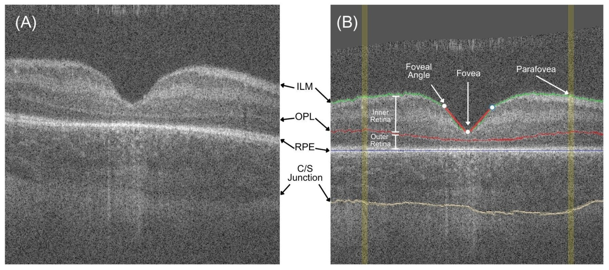

# Napari Optical Coherence Tomography (OCT) Image Segmentation Applications

This codebase has interactive applications created for two projects at the [Cabrera Lab](https://sway.cloud.microsoft/8AAInCiUXVYABvEK?ref=Link) at The University of Washington and Seattle Children's Hospital Departments of Ophthalmology.

The [first project](fovea_analysis) focused on analysis of the fovea and parafovea.
There are two versions of the application which perform the same task, "app_classic.py" and "app_with_dnn.py" which differ only in the layer detection algorithm. The latter uses an LSTM deep learning model.

The [second project](optic_nerve_and_fovea_analysis) added optic nerve analysis in addition to also making measurements of the fovea and parafovea.
The second project has two separate applications, "app_disk_analysis.py" and "app_retina_layer_thicknesses_around_fovea.py" for those tasks respectively. This project also used an LSTM deep learning model for retina layer detection / segmentation.

# Installation

A [more detailed README with installation instructions](fovea_analysis/README.md) is provided in the first project.

Installation of the second project should be analogous and scripts are similarly provided in "install_helpers".

# Example

